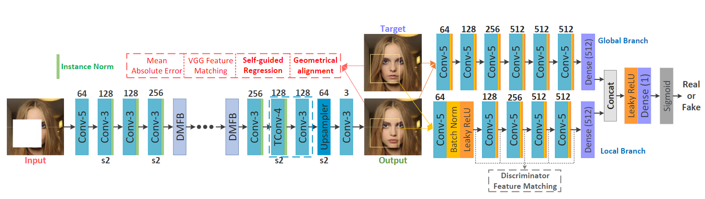
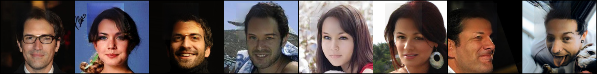
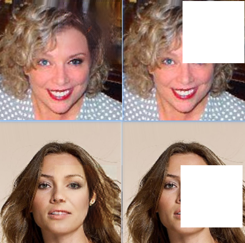
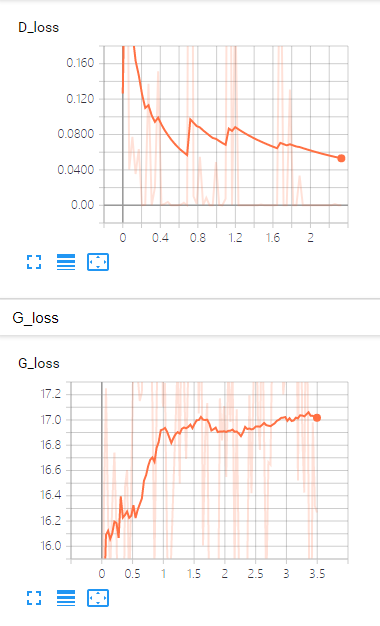

## DMFN (Dense Multi-scale Fusion Network)

This is an unoffical repository for reproducing model DMFN from the paper [[Image Fine-grained Inpainting]](https://arxiv.org/abs/2002.02609). The original repository is [here](https://github.com/Zheng222/DMFN), but author have not commit the rest of implement code yet. 

<p align="center">
  
</p>

## Prerequisites
- Python3.5 (or higher)
- pytorch 1.0(or higher) with GPU
- numpy
- OpenCV
- scipy
- tensorboardX


## RESULT
Note that the following result maybe not as good as the paper because **they are trained only in 1 epoch**. You can get the final result in original author's github. 
### train
<p align="center">
  
</p>

### test
<p align="center">
  
</p>

### loss
<p align="center">
  
</p>

[picture for loss]

## Prepair the dataset
Download the dataset of [celebA](http://mmlab.ie.cuhk.edu.hk/projects/CelebA.html), unzip  and split it to test/train dataset (or you can use my train/test file in CelebA/ ).

## How to test

You can specify the folder address by the option --dataset_path, and set the pretrained model path by --load_model_dir when calling test.py as the following

```
python test.py ---dataset_path celeba_data --data_file img_align_celeba_png\test.txt --load_model_dir pretrained/1epoch
```
**I train it only 1 epoch with single GPU**, you can train it yourself for better performance or in custom dataset.

## How to train
Use train.py as the following 
```
python train.py ---dataset_path celeba_data --data_file img_align_celeba_png\test.txt --batch_size 8 --lr 2e-4
```
You can load the pretrained model by the option --load_model_dir too.

## TODO

- [ ] 中文博客
- [ ] upload pretrained model